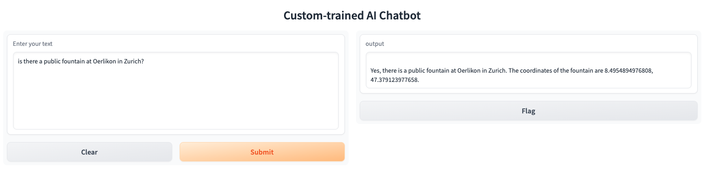
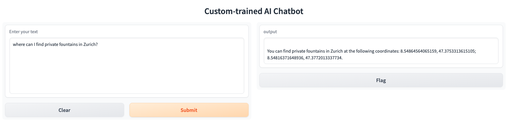
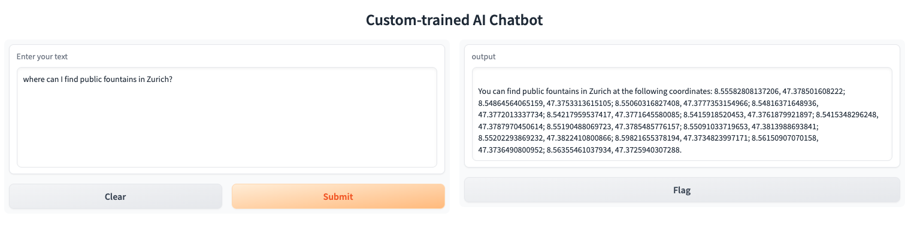
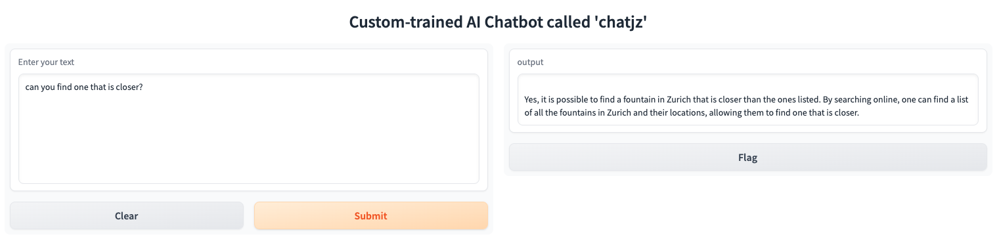

# Can we use ChatGPT for finding fountains in Zurich?
This is a quick hack to explore model fine-tuning of GPT-3 using the OpenAI APIs. Basically it means adding extra layers on top of the LLMs out there. This is a follow-up on my old hack [H2O-Zurich](https://github.com/juntezhang/H2O-Zurich), where instead of using Elasticsearch to query for fountains near me in Zurich, I want to use conversation AI instead. 

It consists of:
- `prepare_data.py` to extract prompt-completion pairs, that can be used to train and build the vector index.
  - `python prepare_data.py > ./docs/brunnen.jsonl`
- `app.py`. It creates a GPT vector index on your local machine called index.json which will consist of vector embeddings using text-davinci-003 as the base model. It uses Gradio to create an UI that can be used to ask and get questions.

Previously I have written [a blog post on how question answering](https://github.com/juntezhang/exploring-question-answering) works.

Does it work? Well, it depends. After creating the GPT vector index, I started to ask some questions.

I wanted to know if there are any public fountains in Oerlikon, Zurich. Note that Oerlikon is a district within Zurich. And it gives me the incorrect answer, and it includes the coordinate to a public fountain on the other side of the city. This is an example of what is called "hallucination".

I also wanted to know if there are any private fountains in Zurich. They may be in courtyards or private property. And yes there are, and it gives me the coordinates to those!

Finally I get my answer for public fountains in Zurich.

When I ask for a fountain close to a retirement home, it returns me a correct fountain.

I noticed that when I asked for a better answer, it refers me to a search engine instead...which may not be a bad idea.

**Note:** the quality of your training set matters! The more data, the better it obviously becomes. When I use the more complete dataset of `./data/wvz.wvz_brunnen.json` I get better answers. You can try it out with `RUN=2 python prepare_data.py`

Still, this is very promising and would be really powerful when my app can add my geo-coordinates to the question, and shows me the public fountains nearby. I mean, stay hydrated! Especially for free...

### Acknowledgements
This work is supported by **Optimizely**. We unlock digital potential. Optimizely creates digital experiences that transform your company to take data-driven decisions, continued experimentation and constant invention. See https://www.optimizely.com/ and we [are hiring](https://www.optimizely.com/careers/)!